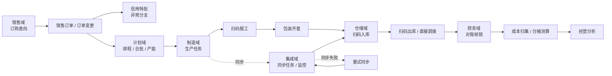
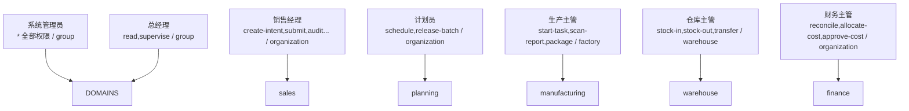

# 现代离散制造 ERP 系统（hch-erp）

> 基于 UmiJS Max + Ant Design Pro 构建的离散制造行业 ERP 前端管理控制台。本项目以**纯前端 Mock 仓储**驱动，完整演示从「销售意向 → 排程计划 → 生产执行 → 仓储物流 → 财务核算 → 系统集成 → 安全治理」的端到端业务闭环与精细化权限模型。

## 目录

- [项目简介](#项目简介)
- [技术栈](#技术栈)
- [核心特性](#核心特性)
- [业务流程图](#业务流程图)
- [权限与角色模型](#权限与角色模型)
- [单据状态机](#单据状态机)
- [目录结构](#目录结构)
- [本地开发](#本地开发)
- [测试与校验](#测试与校验)
- [构建与部署](#构建与部署)
- [Mock 数据说明](#mock-数据说明)

## 项目简介

`hch-erp` 是一个面向离散制造企业的 ERP 管理后台演示项目，用于展示复杂业务域下「多角色协同 + 单据流转 + 数据权限隔离 + 审计追溯」的最佳实践。系统不依赖后端服务，所有业务数据均通过浏览器内存/本地存储的 Mock 仓储（`enterpriseRepository`）提供，并内置完整的单元测试覆盖领域规则。

业务覆盖七大域（Domain）：

| 域 | 关键模块 |
| --- | --- |
| 销售（sales） | 订购意向、销售订单、订单变更、信用特批 |
| 计划（planning） | 排程工作台、合批投放、产能日历 |
| 制造（manufacturing） | 生产任务、扫码报工、包装齐套 |
| 仓储（warehouse） | 扫码入库、扫码出库、直接调拨 |
| 财务（finance） | 对账核销、成本归集、分摊测算、经营分析 |
| 集成（integration） | 同步监控、同步任务、数据映射、集成审计 |
| 安全（security） | 用户管理、角色管理、权限矩阵、授权审计 |

## 技术栈

- **框架**：[UmiJS Max](https://umijs.org/) v4（`@umijs/max`）
- **UI 组件**：Ant Design v6 + `@ant-design/pro-components` + `@ant-design/plots`
- **样式**：`antd-style`
- **语言**：React 19 + TypeScript 7
- **代码规范**：Biome v2（`biome lint`）
- **单元测试**：Vitest 4 + Testing Library（happy-dom 环境）
- **运行时要求**：Node.js >= 22

## 核心特性

- **多角色 & 数据权限**：支持总经理、销售经理、计划员、生产主管、仓库主管、财务主管、系统管理员 7 种角色，按 `group / organization / factory / warehouse / self` 五级数据范围进行隔离（`src/config/roles.ts`）。
- **单据状态机**：统一的业务单据生命周期 `draft → submitted → audited → executing → completed`，并覆盖校验失败、待特批、同步失败、取消等异常分支（`src/domain/billStateMachine.ts`）。
- **成本分摊**：基于物理权重的精确分摊算法，采用「向下取整 + 余数优先补偿」避免金额漂移（`src/domain/costAllocation.ts`）。
- **包装齐套校验**：齐套率与缺失部件的一致性校验（`src/domain/packageKitting.ts`）。
- **扫码校验**：针对报工 / 包装 / 入库 / 出库四类工序的条码合法性、重复扫码、工序错配、未齐套、重复出库校验（`src/domain/barcodeValidation.ts`）。
- **全链路审计**：所有关键操作均记录 `AuditEvent`，支持按模块、操作人、结果、时间检索。
- **页面目录驱动**：所有页面通过 `PAGE_CATALOG` 配置化声明，自动绑定域、模块、所需权限与表格列（`src/config/pageCatalog.ts`）。

## 业务流程图

### 1. 端到端主流程



### 2. 单据状态机

```mermaid
stateDiagram-v2
    [*] --> draft: 创建
    draft --> submitted: submit 提交
    draft --> cancelled: cancel 取消
    submitted --> audited: audit 审核 / special-approve 特批
    submitted --> pending-special-approval: 需特批
    submitted --> cancelled: cancel
    pending-special-approval --> audited: special-approve
    pending-special-approval --> cancelled: cancel
    audited --> executing: start 开始执行
    audited --> cancelled: cancel
    executing --> completed: complete 完成
    executing --> sync-failed: 同步失败
    executing --> validation-failed: 校验失败
    sync-failed --> executing: retry-sync 重试
    validation-failed --> submitted: 重新提交
    validation-failed --> cancelled: cancel
    completed --> [*]
    cancelled --> [*]
```

### 3. 角色与权限矩阵（简化）



## 权限与角色模型

权限判定核心逻辑位于 `src/config/roles.ts`：

- `canAccess(role, domain, action)`：判定某角色是否可对某业务域执行某动作。
- `filterByDataScope(role, records, context)`：按数据范围（集团 / 组织 / 工厂 / 仓库 / 个人）过滤可见单据。
- `ROLE_POLICIES`：集中声明每个角色可见域、可执行动作与数据范围；管理员（`admin`）持有通配 `*` 权限。

动作（`PermissionAction`）涵盖读取、监督、建意向、提交、审核、推送订单、特批、变更、排程、投放、开工、完工、报工、包装、出入库、调拨、重试同步、对账、成本分摊、成本审批、权限变更、用户/角色管理等。

## 单据状态机

见上方[单据状态机](#2-单据状态机)。状态定义在 `src/domain/types.ts` 的 `BillStatus`，转换规则在 `billStateMachine.ts` 的 `transitionBill`，非法转换将抛出可读的中文错误信息。

## 目录结构

```
hch-erp/
├── config/                 # Umi 构建/运行时配置
├── src/
│   ├── components/         # 通用组件（状态标签、时间线、操作确认、详情抽屉、角色切换）
│   ├── config/             # 角色策略、页面目录、产品常量（含单测）
│   ├── domain/             # 纯领域逻辑（状态机、成本分摊、齐套、条码校验 + 单测）
│   ├── models/             # Umi 全局数据模型
│   ├── pages/              # 页面（Dashboard / Records / Workbench / Login / 异常页）
│   │   └── Workbench/panels/  # 各工作台面板
│   ├── runtime/            # Umi 运行时扩展
│   ├── services/enterprise/# Mock 仓储、内存存储、夹具数据 + 单测
│   └── test/               # 测试辅助
├── typings/                # 全局类型声明
├── biome.json              # Biome 代码规范
├── vitest.config.ts        # 测试配置
└── package.json
```

## 本地开发

```bash
# 安装依赖
npm install

# 启动开发服务器（默认 8000 端口）
npm run dev

# 启动并以指定端口预览构建产物
npm run preview
```

> 要求 Node.js >= 22。项目启动后默认进入 Bootstrap 引导页（用于选择演示角色），随后进入经营总览 Dashboard。

## 测试与校验

```bash
# 运行单元测试
npm test

# 类型检查 + 代码规范
npm run lint

# 一次性执行 测试 + lint + 构建
npm run check
```

领域规则（状态机、成本分摊、齐套、条码校验）与权限策略、页面目录、Mock 仓储均配套 Vitest 单元测试，保障核心逻辑正确性。

## 构建与部署

```bash
# 生产构建
npm run build

# 产物输出至 dist/，可用于任意静态资源服务器或容器化部署
```

## Mock 数据说明

- 业务数据由 `src/services/enterprise/mockRepository.ts` 提供，持久化键为 `hch-erp:mock-db:v1`（见 `src/config/product.ts`）。
- 初始化夹具位于 `src/services/enterprise/fixtures.ts`，可在登录后通过「重置演示数据」动作恢复初始状态。
- 所有写操作均带有随机网络延迟模拟，并在成功后写入审计事件（`AuditEvent`）。

## 许可证

私有项目，仅供学习与演示使用。
